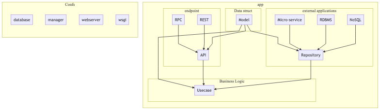

# Flask REST API Tutorial 

## Project Structure

I want to oriented clean architecture such as [go-clean-architecture](<https://github.com/bxcodec/go-clean-arch>)

## Step

1. Make a project structure

2. Flask app configuration, 